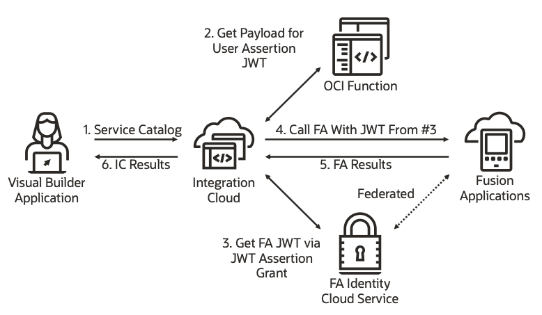

# OIC/FA End-to-End User Identity Propagation

## Introduction

This repository contains source code to accompany a recent blog article by Greg Mally and Mike Muller on [Identity Propagation - VBCS > IC > Fusion Apps ](https://www.ateam-oracle.com/identity-propagation-vbcs-%3E-ic-%3E-fusion-apps).

One of the big challenges that [Oracle Integration Cloud](https://docs.oracle.com/en-us/iaas/integration/index.html) (OIC) developers face is any outbound REST call from [Integration Cloud](https://docs.oracle.com/en/cloud/paas/integration-cloud/create-integrations.html) (IC) to [Oracle Fusion Cloud Applications](https://www.oracle.com/applications/) (FA) APIs require a user’s identity. That is, secure web service transactions require identity propagation to ensure the logged-in user is authorized to view application data. [Visual Builder Cloud Service](https://www.oracle.com/application-development/cloud-services/visual-builder/) (VB) applications can interact with your FA data using REST APIs by using IC as an intermediary to handle identity propagation and token exchange. [Oracle Cloud Infrastructure](https://docs.oracle.com/en-us/iaas/Content/home.htm) (OCI) [Functions](https://docs.oracle.com/en-us/iaas/Content/Functions/Concepts/functionsoverview.htm#Overview_of_Functions) implement your business logic using a cloud-native, serverless approach.

# Solution Architecture

The architecture illustrated above demonstrates the following features:

- Business flow initiated by an authenticated user via a VB application
- Run code within Oracle Functions exposed using the REST protocol that is easily invoked by IC
- Authentication is enforced based on the FA user
- The user identity is propagated throughout the flow: from the VB application, through IC, and on to FA

NOTE: It is important to understand that the Solution Architecture above includes two instances of Identity Cloud Service. One is created and associated with the OIC environment and the other is created and associated with the FA environment. The diagram uses the "FA" prefix to clarify which Identity Cloud Service instance is being used in the pattern.

### Services Used

[Integration Cloud](https://docs.oracle.com/en/cloud/paas/integration-cloud/create-integrations.html) (IC):  This service is used to front end the REST requests, check the requests contain the right authentication credentials and then relay the request to the appropriate Oracle Functions service

[Oracle Functions](https://www.oracle.com/cloud/cloud-native/functions/): Oracle Cloud Functions is a serverless platform that lets developers create, run, and scale applications without managing any infrastructure 

[Oracle Identity Cloud](https://www.oracle.com/cloud/security/cloud-services/identity-cloud.html) (IDCS):  Oracle Identity Cloud Service provides identity management for Oracle Cloud platform and Oracle Cloud Applications, pre-integrated with Oracle Fusion Cloud apps

[Oracle Cloud Infrastructure Vault](https://www.oracle.com/cloud/security/cloud-services/key-management.html): Oracle Cloud Infrastructure Vault is a managed service, so you can focus on your encryption needs rather than on procuring, provisioning, configuring, updating and maintaining HSMs and key management software. For this example we use Key Management Service to store the OAuth Client Secret's in an encrypted form

[Visual Builder Cloud Service](https://docs.oracle.com/en/cloud/paas/integration-cloud/vbcs.html) (VB): Is Oracle's Low Code HTML development environment, ideal for extending Oracle SaaS.

[Oracle Fusion Cloud Applications](https://www.oracle.com/applications/) (FA): Oracle Fusion SaaS is a market leading set of enterprise applications covering ERP, HCM, Customer experience and many more business application areas

### Solution Walkthrough
1. The user authenticates with Oracle Cloud (e.g., VB application, FA, or cloud.oracle.com).
2. The user launches the VB application standalone or from within FA.
3. The VB application invokes an IC orchestration using OAuth 2.0 User Assertion.
4. The IC orchestration invokes the OCI Function and passes in the calling user's identity.
5. The OCI Function generates and signs the appropriate JWT payload for an IDCS REST API call.
6. The IC orchestration uses the JWT from the previous OCI Function call to invoke IDCS to retrieve a User Assertion JWT.
7. The JWT retrieved in the previous IDCS call is used to make two FA REST API calls for person and absence details.
8. The data returned from the previous FA REST API calls is mapped into a JSON payload.
9. The payload is returned to the VB application where it is displayed to the user.

### Solution Notes

- Although the client used in this example is a Visual Builder application, you can implement a similar pattern using a different end-user application that can make REST API calls, such as Oracle ADF Faces, ReactJS, Oracle Fusion CX Cloud Groovy functions, an Oracle Mobile Hub application, etc.
- The OIC IDCS instance is Federated with FA, so the user is known throughout the technology stacks (VB, IC, and FA). This IDCS instance is not represented in the Solution Architecture diagram but provides identity management for all the OIC features (IC, VB, Processes, and Insight).
- Since this pattern involves several sub-components, each of the sub-components contain their own README.md (see links in Installing and Running section).

## Installing and Running

To install and run this example, follow the steps below, each of which link to a set of detailed instructions for each step.

1. [Configure IDCS and Deploy the OCI Function](./function/README.md)
2. [Import, configure, and test IC integration](./integration/README.md)
4. [Import, configure, test, and run VB application](./vbcs/README.md)

## Contributing
Propagating User Identity from Visual Builder to Integration Cloud to Fusion Applications APIs is an open source project.
See [CONTRIBUTING](./CONTRIBUTING.md) for details.
Oracle gratefully acknowledges the contributions to Propagating User Identity from Visual Builder to Integration Cloud to Fusion Applications APIs that have been made by the community.

## Security
For more information on security please see [SECURITY.md](SECURITY.md) 

## Help
If you need help with this sample, please log an issue.

Copyright (c) 2021, Oracle and/or its affiliates.  
Licensed under the Universal Permissive License v 1.0 as shown at https://oss.oracle.com/licenses/upl.

