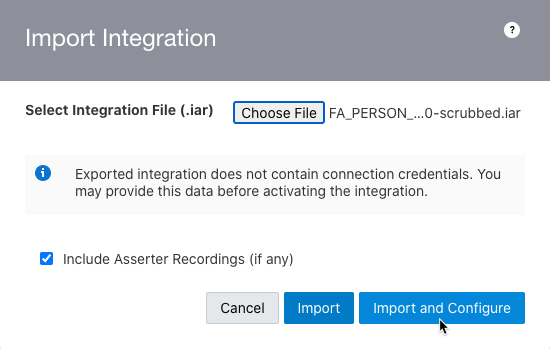
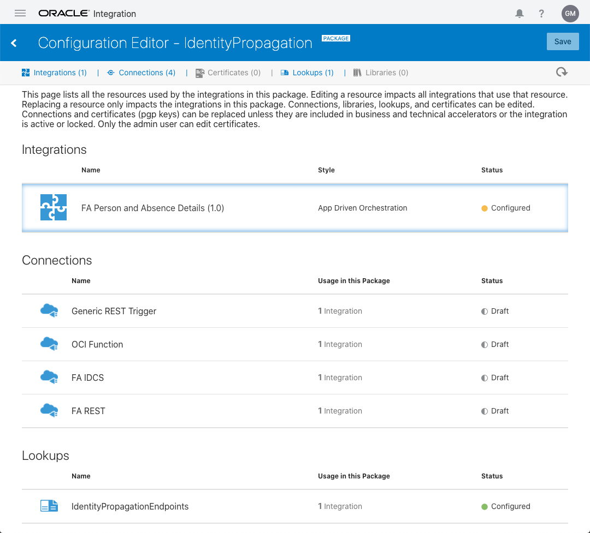
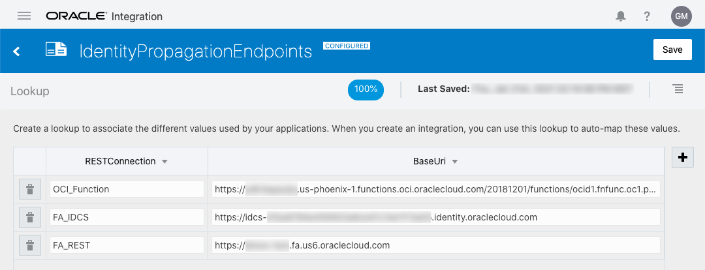
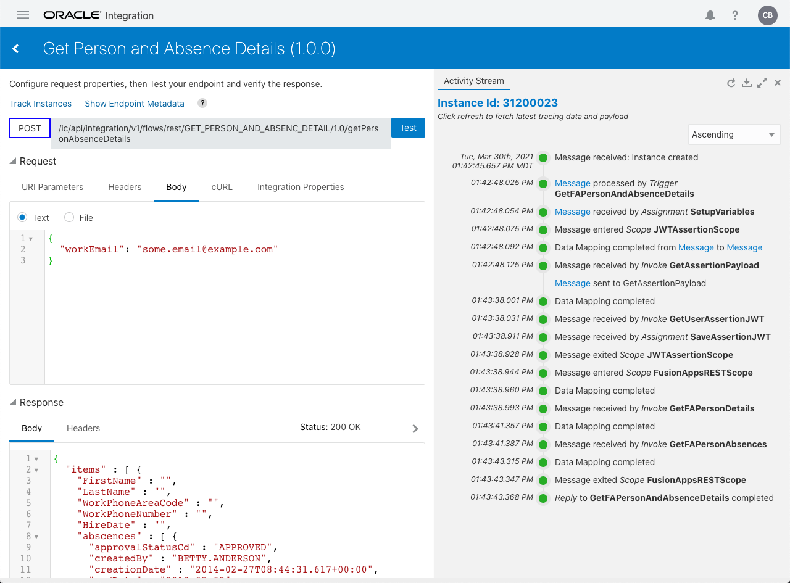
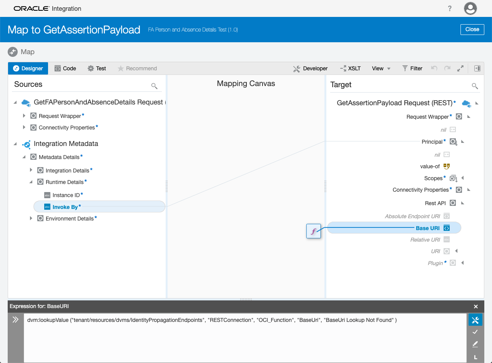

# Person and Absence Orchestration
This integration demonstrates the following:
1. Call the Oracle Cloud Infrastructure (OCI) function that generates the Oracle Identity Cloud Service (IDCS) payload for User Assertion
2. Call the IDCS REST API with the payload from step 1 to obtain the User Assertion JWT
3. Call FA with the JWT from step 2

More details can be found in the following blog under **IC Integration**:
https://www.ateam-oracle.com/identity-propagation-vbcs-%3E-ic-%3E-fusion-apps


## Solution Architecture


This integration is doing steps 2 through 6 in the flow above.  To make things more real world, step 4 is actually two calls from the integration to FA and the data is consolidated into a single resultset (i.e., the response payload in step 6).

## Products Involved

Oracle Integration Cloud Service (OIC)
Integration Cloud (IC) Associated with OIC
Oracle Fusion Applications (FA)
IDCS Associated with OIC and FA

## Prerequisites

For this integration to be configured and testable from the IC testing framework (i.e., no Visual Builder), the **IDCS Federation** and **OCI Function** must be completed per the [blog mentioned above](https://www.ateam-oracle.com/identity-propagation-vbcs-%3E-ic-%3E-fusion-apps).

## Getting Started

The setup and configuration for this integration will require creating an IAR (Integration Archive/Export) from the files in the exploded IAR directory: [FA_PERSON_AND_ABSENC_DETAIL_01.00.0000](./FA_PERSON_AND_ABSENC_DETAIL_01.00.0000)

To create an importable IAR, the following command can be used from within the [FA_PERSON_AND_ABSENC_DETAIL_01.00.0000](./FA_PERSON_AND_ABSENC_DETAIL_01.00.0000) directory:
```bash
> zip -r -D ../FA_PERSON_AND_ABSENC_DETAIL_01.00.0000-scrubbed.iar icspackage
> ls -l ..
total 88
drwxr-xr-x 3 - -   102 Feb 10 12:29 FA_PERSON_AND_ABSENC_DETAIL_01.00.0000
-rw-r--r-- 1 - - 83695 Feb 26 15:45 FA_PERSON_AND_ABSENC_DETAIL_01.00.0000-scrubbed.iar
-rw-r--r-- 1 - -  3273 Feb 26 15:45 README.MD
```

At this point we are ready to start working in the OIC console.

## Importing the IAR

Importing the IAR we created above is well document in the IC documentation under [Import an Integration](https://docs.oracle.com/en/cloud/paas/integration-cloud/integrations-user/import-and-export-integrations.html#GUID-0678B0AB-9948-4563-8035-5E23221ACAD4).  When you get to the step where it says to "Click **Import**", click on **Import and Configure** instead:



## Configuration

At this point you should see something like the following:



All of the Connections will need to either be configured or replaced if they were created prior to the import via the [Configuration Editor](https://docs.oracle.com/en/cloud/paas/integration-cloud/integrations-user/edit-and-replace-dependent-resources.html#GUID-BE836D8E-9675-4013-8B77-4DDDE15BFE5F).  When configuring the Lookups, the only things that need changing are the BaseUri values.  These values will look something like this when you are done updating:



Once you are done configuring the Connections and the Lookups, you can [Activate](https://docs.oracle.com/en/cloud/paas/integration-cloud/integrations-user/activate-integration.html) and [Run](https://docs.oracle.com/en/cloud/paas/integration-cloud/integrations-user/test-rest-adapter-trigger-integrations.html#GUID-D0B8B64C-2ED8-40AC-A21C-646287C92074) the integration using the OIC console.

## Testing the Integration

Using the on-line documentation to [Test REST Adapter Trigger Connection-Based Integrations](https://docs.oracle.com/en/cloud/paas/integration-cloud/integrations-user/test-rest-adapter-trigger-integrations.html#GUID-D0B8B64C-2ED8-40AC-A21C-646287C92074), locate the activated integration and run a test using a valid FA user email that has associated absence records. You should see something like the following:



## How the Code Works
Instead of walking through the integration in detail, the important aspects of the code can be found in the blog mentioned above. What is not covered in the blog is a technique being leveraged for overriding the REST endpoints via IC Lookups. One of the big benefits of using lookups for the Base URI in the integration is you can switch environments/configurations without having to deactivate, change the connection configuration, and reactivate the integration. This is very useful when working with functions as the Base URI changes for every new version of a function. So when you are testing a function and updating the version of that function, you can have an activated integration point to the new version without touching the integration. Here's what the mapping looks like:



## Why Explode the IAR
In order to provide code samples for public consumption, we are required to include copyright details and cleanup any sensitive information in the exported artifacts.

## How to Contribute
`Propagating User Identity from Visual Builder to Integration Cloud to Fusion Applications APIs` is an open source project.

See [CONTRIBUTING](CONTRIBUTING.md) for details.

Oracle gratefully acknowledges the contributions to `Propagating User Identity from Visual Builder to Integration Cloud to Fusion Applications APIs` that have been made by the community.

## Changes
See [CHANGELOG](CHANGELOG.md).

## Known Issues

None

## Security
See [SECURITY](SECURITY.md) for details.

## License
Licensed under the [Universal Permissive License v1.0](https://oss.oracle.com/licenses/upl)

See [LICENSE](LICENSE.txt) for details.

## Copyright
Copyright (c) 2021, Oracle and/or its affiliates.
