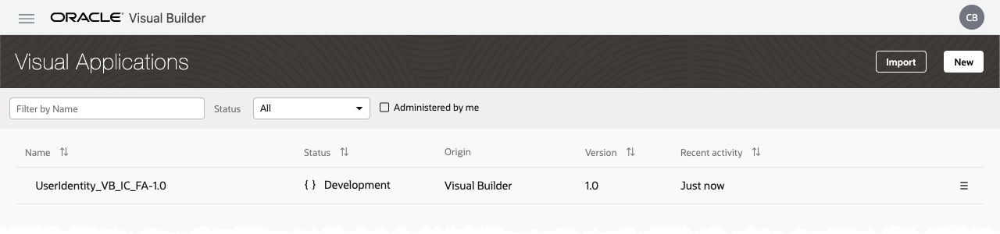
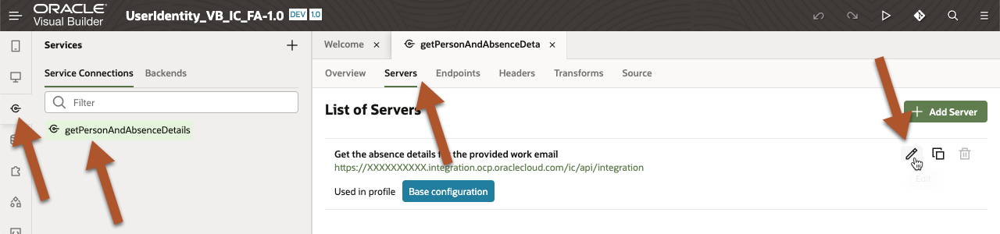
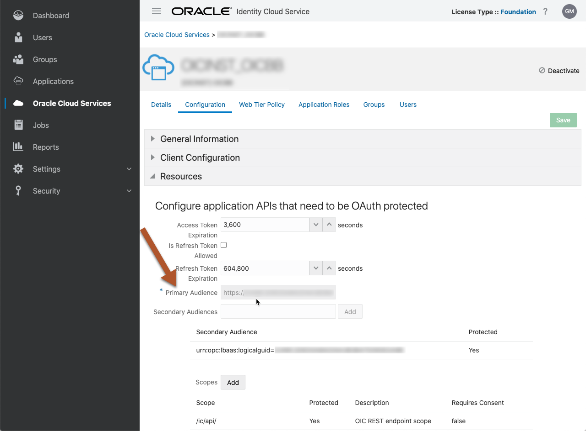
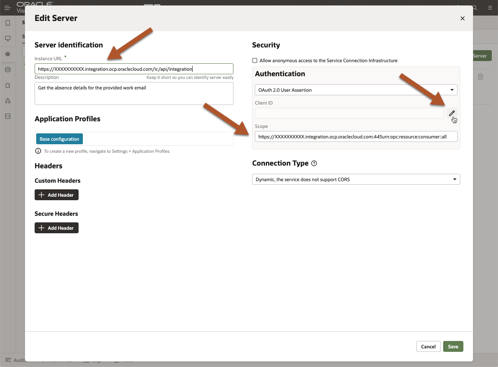
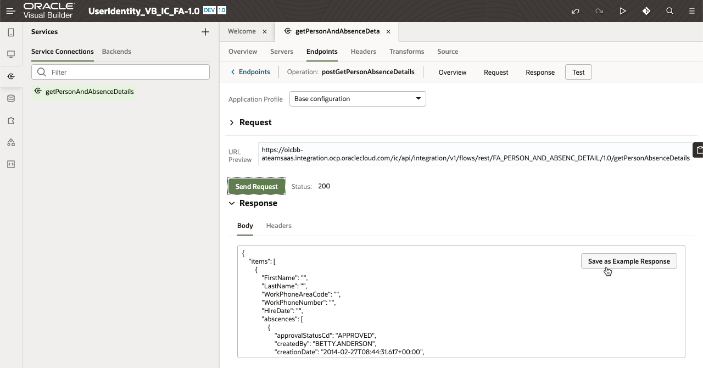
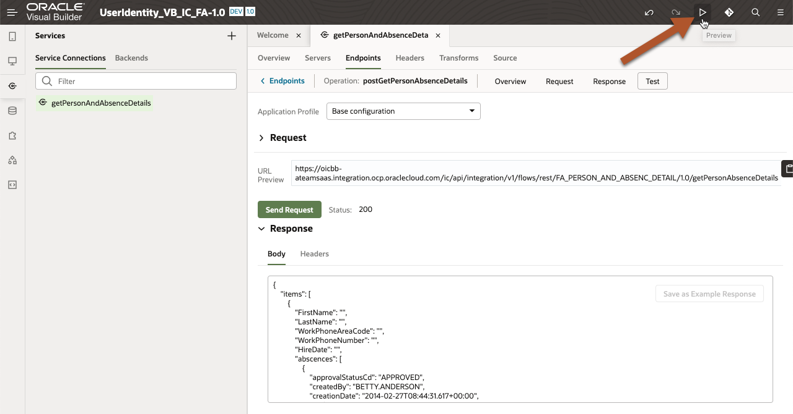
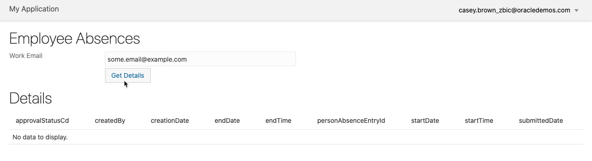
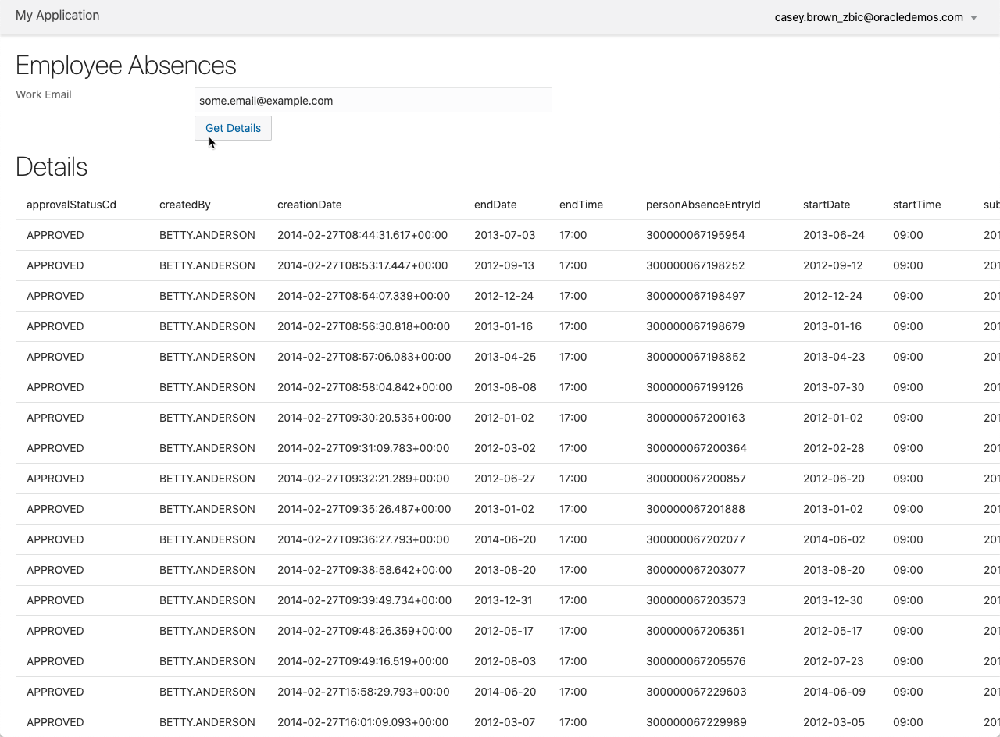

# Visual Builder (VB) Web Application
To initiate the flow for identity propagation, an authenticated client application is needed. In the spirit of Oracle Integration Cloud Service (OIC), the Visual Builder feature was used. The VB application provided here is very simple and straightforward. The high-level steps needed to get it going is comprised of:

1. Create a .zip archive
2. Import the .zip archive into your OIC VB instance
3. Configure the IC Service and [Person and Absence Orchestration](../integration) endpoint
4. "Preview" the Web Application in the VB UI

## Solution Architecture


This VB application is the actor on the left-hand side of the Solution Architecture.

## Products Involved

Oracle Integration Cloud Service (OIC)
Integration Cloud (IC) Associated with OIC
Visual Builder (VB) Associated with OIC
IDCS Associated with OIC and FA

## Prerequisites

For this Web Application to be configured and functional, the [Person and Absence Orchestration](../integration) must be setup and tested successfully from the [IC Test Framework](https://docs.oracle.com/en/cloud/paas/integration-cloud/integrations-user/test-rest-adapter-trigger-integrations.html#GUID-D0B8B64C-2ED8-40AC-A21C-646287C92074).

## Getting Started

The setup and configuration for this Web Application will require creating a .zip from the files in the [UserIdentity_VB_IC_FA-1.0](./UserIdentity_VB_IC_FA-1.0) directory.

To create the importable .zip, the following command can be used from within the [UserIdentity_VB_IC_FA-1.0](./UserIdentity_VB_IC_FA-1.0) directory:
```bash
> zip -r -D ../UserIdentity_VB_IC_FA-1.0-scrubbed.zip .
> ls -l ..
total 36
-rw-r--r-- 1 - -  3540 Feb 26 12:33 README.MD
drwxr-xr-x 9 - -   306 Feb 26 07:43 UserIdentity_VB_IC_FA-1.0
-rw-r--r-- 1 - - 19148 Feb 26 12:32 UserIdentity_VB_IC_FA-1.0-scrubbed.zip
```
At this point we are ready to start working in the VB UI.

## Importing the Zip Archive
To import the .zip you created in the previous section, follow the details in the online documentation to [Import a Visual Application](https://docs.oracle.com/en/cloud/paas/integration-cloud/visual-developer/import-and-export-applications.html#GUID-845B8CD3-E196-4865-8F19-24F29B472B5D). Once you are done you should see something like the following:



## Service Server Configuration
**NOTE:** Although the blog and the Solution Architecture show the application as being configured with the Service Catalog, this example is using an OIC Server configuration with OAuth 2.0 User Assertion.

The first step is to locate the **List of Servers** in the VB UI so we can open the **Edit Server** dialog for the **getPersonAndAbsenceData Service**:



Provide the following details from your OIC instance:

1. Instance URL
5. Add Client ID and Secret from **OIC IDCS Console > Oracle Cloud Services > OIC Application** (or an IDCS application configured to trigger IC integrations)
6. Verify that the Scope is prefixed with Primary Audience from the **OIC IDCS Console > Oracle Cloud Services > OIC Application > Configuration > Resources** section:



The aforementioned details will be provided in the Edit Server dialog window:



Now that the server details are set, we can check out the endpoint in the next section.

## Service Endpoint Configuration and Test
For configuring and testing the endpoint, we will make sure that the endpoint URL matches the endpoint you have activated in IC and that we have an email address for a user that contains absence details. With these details we can test the endpoint to validate that data is indeed being returned from FA.  If the test succeeds, we know that the full end-to-end identity propagation is working but only being displayed in the VB Service Endpoint Test page.

1. **getPersonAndAbsenceDetails Service** > **Endpoints Tab** > **postGetPersonAbsenceDetails** > **Request** > **Parameters**
2. Verify **Path URL** matches your activated IC endpoint
```text
/v1/flows/rest/FA_PERSON_AND_ABSENC_DETAIL/1.0/getPersonAbsenceDetails
```

3. **Endpoints Tab** > **Request** > **Body**
Make sure that the request payload is in the following format and contains a valid email for a user setup in FA:
```json
{
 "workEmail" : "some.email@from.fa"
}
```
4. **Endpoints Tab** > **Test**
5. **Send Request**
6. Verify Response:



## "Preview" the Web Application
If you have reached this point, we already know that your end-to-end identity propagation pattern is working and ready for prime time.  However, it would be nice to see the results displayed in a VB page vs. the raw JSON payload in the VB Service Endpoint Test page. We can view the FA Person Absence Details by using the VB **Preview** feature:



------



------



## Why Explode the VB Export
In order to provide code samples for public consumption, we are required to include copyright details and cleanup any sensitive information in the exported artifacts.

## How to Contribute
`Propagating User Identity from Visual Builder to Integration Cloud to Fusion Applications APIs` is an open source project.

See [CONTRIBUTING](CONTRIBUTING.md) for details.

Oracle gratefully acknowledges the contributions to `Propagating User Identity from Visual Builder to Integration Cloud to Fusion Applications APIs` that have been made by the community.

## Changes
See [CHANGELOG](CHANGELOG.md).

## Known Issues

## Security
See [SECURITY](SECURITY.md) for details.

## License
Licensed under the [Universal Permissive License v1.0](https://oss.oracle.com/licenses/upl)

See [LICENSE](LICENSE.txt) for details.

## Copyright
Copyright (c) 2021, Oracle and/or its affiliates.
